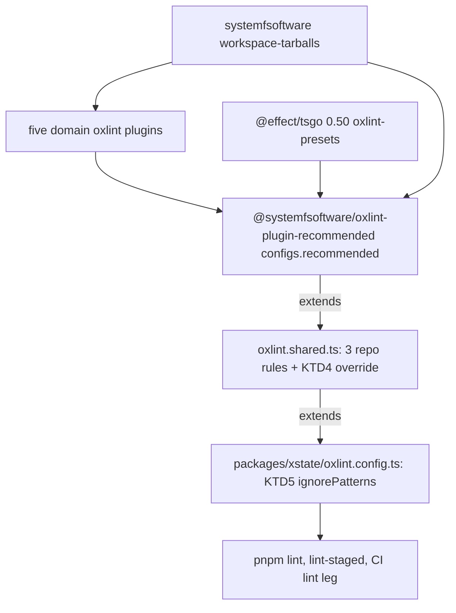

# Own Lint Configs - Plan

## Goal Capsule

- **Objective:** a change to a systemfsoftware tool configuration no longer re-grades xstate's work. xstate's lint policy lives in xstate's own files, and what crosses the repo boundary is plugins (rules and presets), never a configuration package.
- **Means:** replace the `@systemfsoftware/oxlint-config-recommended` import with `@systemfsoftware/oxlint-plugin-recommended`'s `configs.recommended`, wired from the repo's own `oxlint.shared.ts` (KTD3), and stop the from-source mutation-engine build from installing config packages (KTD2).
- **Authority:** the conductor-owned config-ownership contract (Ryan, 2026-10-08) with its tsconfig exception and the session override, then this Product Contract, then this Planning Contract, then `CONSTITUTION.md` and `AGENTS.md`.
- **Open blockers:** D1 (Risks & Dependencies) gates U3 and U4. OQ2 (parked) gates only U2's last step, the overlay lockfile regeneration; every other U2 step is ready before it.
- **Stop conditions:** stop and report if the effective lint for `packages/xstate` loses a rule or a severity that KTD4 cannot restore from a package already in the lockfile; if the real lint-run file count differs before and after (KTD5); if the bumped distribution drops `@systemfsoftware/tsconfig`; if the from-source build needs a lint package to build; if going green would need a rule, threshold or test weakened.
- **Execution profile:** `ce-work`, then `ce-code-review` as its own step with findings reported unapplied; a two-layer `gh stack` on trunk `main` (KTD1); no local mutation runs; no force-push; plain `git push`.
- **Who finishes:** this session implements and reviews; the conductor rules on findings and merges.

---

## Product Contract

Product Contract preservation: changed: R10 added (repository docs), surfaced by the predicate grep's `README.md` hit; R1–R9 unchanged.

### Summary

xstate's lint configuration becomes a repo-owned file that extends the plugin preset `configs.recommended` and adds xstate's own overrides and ignore patterns. The config packages leave every manifest, catalog, override and lockfile, including the from-source build of the mutation engine. tsconfig, vitest, tsdown and stryker configuration stay as they are.

### Problem Frame

xstate imports `@systemfsoftware/oxlint-config-recommended` from the systemfsoftware workspace tarballs. That package decides which rules grade xstate, and it pins its own `@effect/tsgo` (0.45) while xstate runs 0.50, so the rule set xstate is graded by is chosen by another repo's release, at another tool version. The systemfsoftware monorepo is retiring its config packages from distribution; a revision that drops them would break xstate's install outright.

### Requirements

**Repo boundary**

- R1. No xstate manifest, catalog, override, import or lockfile resolution names a systemfsoftware CONFIG package (`oxlint-config-*`, `vitest-config`, `tsdown-config`, `stryker-config`, `@systemfsoftware/all`).
- R2. The from-source build of the mutation engine installs no systemfsoftware CONFIG package from the distributed tarballs.
- R3. Lint presets come from `@systemfsoftware/oxlint-plugin-recommended` and the five domain plugins, all from the same systemfsoftware workspace-tarball distribution xstate uses today.

**Owned lint configuration**

- R4. Each xstate lint root's effective configuration loses no rule and weakens no severity compared with before; every difference is listed and justified.
- R5. xstate declares the ignore patterns its lint roots need in its own configuration, since presets carry none.
- R6. The repo-owned lint base stays a plain repo file extended by relative path, never published or packaged.

**Untouched surfaces**

- R7. tsconfig files keep extending `@systemfsoftware/tsconfig`, and the vitest, tsdown and stryker configurations keep their current repo-owned form.

**Evidence**

- R8. The PR body records, from the real tools, before and after: the effective lint config per lint root, the lint-run summary, the resolved tsconfig per project, and the vitest test list per package.
- R9. CI is green on each PR head SHA, with logs showing lint executed (not replayed from cache) and tests ran.

**Docs**

- R10. Repository docs name the plugin preset and the repo's own config file, not a config package.

### Key Decisions

- **The lint base stays at the repo root.** `packages/AGENTS.md` XS1 has each enrolled member extend `oxlint.shared.ts`; an internal shared file inside the monorepo is allowed by the contract. Governs R6.
- **Presets reach xstate through one plugin package.** The preset jsPlugins resolve from that package's own dependencies, so xstate wires no domain plugin by hand. Governs R3.
- **A rule moved by a tool version is restored, not dropped.** Where the plugin preset's newer `@effect/tsgo` presets no longer carry a rule the old config enabled, xstate re-enables it in its own config. Governs R4.

### Scope Boundaries

- Any tsconfig change (shared base stays, per the tsconfig exception).
- Migrating stryker-js-effect's own lint configuration; that repo owns it.
- New lint rules, thresholds or gates beyond what R4 restores.
- Considered and not built: a test or check pinning the preset contents or the predicate grep. It would restate authored config (`CHK1`) and add a gate (`GATE1`); the evidence is real-tool output in the PR body.

### Dependencies / Assumptions

- systemfsoftware publishes `@systemfsoftware/oxlint-plugin-recommended` 2.0.0 in `workspace-tarballs` on its `main` (D1).
- That systemfsoftware revision still distributes `@systemfsoftware/tsconfig`, per the tsconfig exception (D2).

### Sources

- `oxlint.shared.ts`, `packages/xstate/oxlint.config.ts`, `pnpm-workspace.yaml`, `package.json`, `flake.nix`, `nix/from-source.nix`, `nix/stryker-js/`.
- systemfsoftware `docs/plans/2026-10-09-0014-refactor-plugin-presets-internal-configs-plan.md` and `packages/oxlint-plugin/oxlint-plugin-recommended/src/` on branch `chore/own-configs` (head `edf81999`): the preset shape and oxlint's `extends` behaviour (its KTD2).
- oxc#23143 and oxc#10223 (`ignorePatterns` not carried through `extends`); oxc#22925 (merge order: inherited `overrides` apply after the child's top-level `rules`; a maintainer comment there also reports `--print-config` incomplete under `extends`).

---

## Planning Contract

### Current State

| Surface                                         | Today                                                                                                                                                         | Consumes a config package? |
| ----------------------------------------------- | ------------------------------------------------------------------------------------------------------------------------------------------------------------- | -------------------------- |
| oxlint                                          | `oxlint.shared.ts` imports `@systemfsoftware/oxlint-config-recommended` 4.0.0; one lint root, `packages/xstate`, extends it                                   | yes                        |
| `package.json` / `pnpm-workspace.yaml`          | root devDependency `oxlint-config-recommended`; catalog and overrides list `oxlint-config-{cell-architecture,dmmf,recommended}` beside five `oxlint-plugin-*` | yes                        |
| `nix/stryker-js/` (from-source mutation engine) | stryker-js-effect's packages devDepend on `oxlint-config-recommended`, installed from `.sfs-deps`; its catalog and overrides list the three `oxlint-config-*` | yes                        |
| vitest                                          | six self-contained `packages/*/vitest.config.ts`, importing `vitest/config` and `@systemfsoftware/vitest` (a plugin)                                          | no                         |
| tsdown                                          | `tsdown.shared.ts`, repo-owned                                                                                                                                | no                         |
| stryker                                         | `stryker.shared.ts`, repo-owned; imports only `@systemfsoftware/stryker-js` types (the engine)                                                                | no                         |
| tsconfig                                        | extends `@systemfsoftware/tsconfig` (shared base, stays)                                                                                                      | exception                  |
| Nix                                             | `systemfsoftware.packages.<system>.workspace-tarballs` whole, no `lib.mkConsumerStore`                                                                        | via tarballs               |

Version skew inside the old config: its `@effect/tsgo` dependency resolves to 0.45.0 in `pnpm-lock.yaml`, while xstate's root runs 0.50.0. Between those versions, `@effect/tsgo/oxlint-presets` moved 21 rules out of `correctness`/`recommended` into `effectNative`. The old config re-lists 7 of them by name; the other 14 are lost by a straight move (KTD4).

### Key Technical Decisions

- KTD1. **Two layers on trunk `main`.** Layer 1 (`chore/own-lint-configs`, carrying this plan) holds U2. Layer 2 holds U3 and U4. Layer 1 is useful alone and leaves `main` releasable; layer 2 must land as one change because the bumped tarball set no longer contains the config packages the current lockfile names.
- KTD2. **The from-source build drops every lint devDependency.** `nix/stryker-js/prepare-source.mjs` removes each devDependency whose name contains `oxlint` before it validates specifiers. That filter drops exactly: the three `@systemfsoftware/oxlint-config-*` tarballs, `oxlint`, `oxlint-tsgolint`, and stryker-js-effect's in-tree `@systemfsoftware/oxlint-ignorer-config` (`workspace:^` link). All are lint-only: only `oxlint.config.ts` files import `oxlint-ignorer-config`, which has no build script and is not in the packed list, and the one package whose build ran `typecheck` (`@systemfsoftware/stryker-js`) already has it stripped. The overlay `pnpm-workspace.yaml` loses the catalog and override entries no importer still uses; the overlay lockfile is regenerated. `nix/from-source.nix` only installs, builds and packs, so no lint package is needed. Rejected: naming `oxlint-config-recommended` in `DENIED_DEV`, which breaks again the day stryker-js-effect moves to the plugin preset. Governs R2.
- KTD3. **Config shape.** `oxlint.shared.ts` default-exports `extends: [presets.configs.recommended]`, its three existing top-level rules unchanged, and the KTD4 override. `packages/xstate/oxlint.config.ts` extends the shared file and lists the KTD5 `ignorePatterns` itself (conductor ruling 17), because `extends` drops them. Rejected: deleting `oxlint.shared.ts` and inlining into the one root, which contradicts XS1. Governs R3, R5, R6.
- KTD4. **Restore the 14 moved `effecttsgo` rules at `error` in an xstate override.** Rules: `async-function`, `crypto-random-uuid`, `crypto-random-uuid-in-effect`, `extends-native-error`, `global-console`, `global-console-in-effect`, `global-fetch`, `global-fetch-in-effect`, `global-random`, `global-random-in-effect`, `instance-of-schema`, `prefer-schema-over-json`, `process-env-in-effect`, `schema-sync` (all `effecttsgo/`). Scope: `**/src/**` plus the old entry patterns (`**/*.test.ts`, `**/*.spec.ts`, `**/__tests__/**`, `**/tests/**`, `**/test-types/**`, `**/examples/**`), the scope the old `libraryRules`/`entryRules` overrides gave them. An override, not top-level `rules`, so it applies after the inherited preset overrides (oxc#22925). Rejected: extending all of `effectNative`, which adds rules the old set never had. The U1 diff decides the final list; this one comes from the two published preset files. Governs R4.
- KTD5. **The ignore list reproduces today's linted set exactly (conductor ruling 17).** Today the old presets' `ignorePatterns` are dropped through `extends`, so the effective list is `[]` (observed in `--print-config`) and oxlint's own `.gitignore` handling is the only exclusion. The owned list therefore names only paths `.gitignore` already excludes under a package: `**/dist/**`, `**/coverage/**`, `**/reports/**`, `**/.stryker-tmp/**`, `**/temp/**`. `**/*.d.ts` is left out: `.gitignore` does not cover it, so a hand-written declaration file is linted today and must stay linted. Gate: the real lint-run file count for `packages/xstate` matches before and after; a pattern that moves the count is removed. Governs R5.
- KTD6. **One distribution bump carries the preset.** The `systemfsoftware` flake input moves to the `main` commit that ships `oxlint-plugin-recommended` 2.0.0. In the same change: root devDependency, catalog and override switch from `oxlint-config-*` to `oxlint-plugin-recommended`; the five plugin catalog and override entries stay so the preset's dependencies resolve offline from `.sfs-deps`; the root lockfile, every from-source overlay lockfile (mutation engine, `effect-cell-types`, `attw`) and the workspace `fetchPnpmDeps` hash are regenerated. `@systemfsoftware/oxlint-plugin-recommended` is the one package new to the lockfile; the session override requires it. Governs R1, R3.
- KTD7. **Evidence comes from the real tools, run in throwaway places, never committed.** `oxlint --print-config` alone is not enough: it omits `jsPlugins` (it does emit the root's own `ignorePatterns`, `[]` today) and is reported incomplete under `extends`. Each snapshot therefore pairs it with the lint-run summary line (file count, findings) and a planted-violation matrix (U1). Governs R8.
- KTD8. **The local mutation guard refuses any command containing the word `stryker`** (observed this session on a plain `ls`). Building the from-source tarballs goes through `nix build .#source-deps`, which already contains them. The overlay lockfile app is `nix run .#stryker-js-lock`; it is parked (OQ2) and is never routed around the guard.
- KTD9. **U2's lockfile regeneration is its single last manual step.** Every U2 edit is made and committed on the local layer-1 branch first. Those commits are not pushed until the regeneration lands, because the overlay's frozen install rejects manifests that no longer match its lockfile. What follows the regeneration (root lockfile, deps hash, gates) is mechanical and consumes the regenerated build's tarballs, so it cannot run earlier.

### Lint Config Flow

### Predicate Residue

The pilot predicate `git grep -nE 'oxlint-config-(recommended|cell-architecture|dmmf|rule-authoring)|@systemfsoftware/(vitest-config|tsdown-config|stryker-config)'` hits these files today: `README.md`, `oxlint.shared.ts`, `package.json`, `pnpm-lock.yaml`, `pnpm-workspace.yaml`, `nix/stryker-js/pnpm-lock.yaml`, `nix/stryker-js/pnpm-workspace.yaml`. After layer 2 the expected residue is:

| Hit                                                                                                                                                                                          | Class                                                                                          | Why it stays                                                  |
| -------------------------------------------------------------------------------------------------------------------------------------------------------------------------------------------- | ---------------------------------------------------------------------------------------------- | ------------------------------------------------------------- |
| `docs/plans/2026-10-09-0330-refactor-own-lint-configs-plan.md`                                                                                                                               | finished-plan history                                                                          | names the removed packages to describe the removal            |
| `nix/stryker-js/pnpm-lock.yaml` importer entries for stryker-js-effect's in-repo `link:` packages (`@systemfsoftware/{vitest-config,tsdown-config,stryker-config}`, `oxlint-ignorer-config`) | internal to this repo's pinned mutation-engine source; allowed leftovers (conductor ruling 17) | never resolved from a distribution; classified in the PR body |

### Risks & Dependencies

| ID  | Risk or dependency                                                                                                                                                                                                                                                                                  | Mitigation                                                                                                                                                          |
| --- | --------------------------------------------------------------------------------------------------------------------------------------------------------------------------------------------------------------------------------------------------------------------------------------------------- | ------------------------------------------------------------------------------------------------------------------------------------------------------------------- |
| D1  | `oxlint-plugin-recommended` 2.0.0 is not yet in systemfsoftware `main`'s `workspace-tarballs` (branch `chore/own-configs` holds it at 1.3.3 with the 2.0.0 changeset pending)                                                                                                                       | U3 and U4 wait; U2 does not depend on it                                                                                                                            |
| D2  | Settled (conductor ruling 15): `@systemfsoftware/tsconfig` is public and distributed again (systemfsoftware #680)                                                                                                                                                                                   | U3 confirms `tsconfig` is still in the built `workspace-tarballs` index; otherwise stop condition                                                                   |
| R-a | The bump rebuilds every tarball; a domain plugin at the same version string can still carry new rules                                                                                                                                                                                               | U5's diff shows it; new findings in `packages/xstate` are fixed in code under REPO-W10, never by rule edits                                                         |
| R-b | The newer `@effect/tsgo` presets add rules (`experimental-api-usage`, `catch-if-tag-to-catch-tag`, `catch-refail-to-tap-error`, `flat-map-ignored-param-to-and-then`); the preset turns `unstable-api-usage` off                                                                                    | additions are allowed by R4 and listed; `unstable-api-usage` never existed in the old set, so nothing is lost                                                       |
| R-c | Turbo replays the CI lint leg from cache and nothing actually lints. Lint's inputs are the package's files, its tsconfigs and `$TURBO_ROOT$/oxlint.shared.ts`; the lockfile is not one. Layer 2 changes `oxlint.shared.ts`, so its hash moves; layer 1 changes no lint input, so a replay is likely | U5 records each CI leg's cache status; on a replay, it records a forced local `turbo run lint test --force` summary on the same head SHA and says so in the PR body |
| R-d | The changeset gate counts packages re-hashed by the lockfile change                                                                                                                                                                                                                                 | run `changeset-management` in the dev shell during U3; add a `none` intent naming each reported package                                                             |

### Sequencing

U1 runs at the base commit before any edit. U2 forms layer 1; its edits are committed locally and pushed only after the parked lockfile regeneration (OQ2, KTD9). U3 then U4 form layer 2 once D1 holds. U5 runs after each layer's last edit and before each PR is opened.

---

## Implementation Units

### U1. Capture the before-snapshots

- **Goal:** the baseline every after-snapshot is diffed against.
- **Requirements:** R4, R8.
- **Dependencies:** none.
- **Files:** none committed; outputs go to a throwaway directory outside the tree.
- **Approach:**
  1. In `packages/xstate`, record `oxlint --config oxlint.config.ts --print-config` normalised with `jq -S`, and the summary line of `pnpm --filter @systemfsoftware/xstate lint` (files, rules, findings).
  2. Plant one violation per domain plugin (cell-architecture, dmmf-workflow, effect-schema, effect-platform, test-discipline) and one per KTD4 rule that a plain `src` file can trigger; run the real lint; record each (rule, file) pair; delete the plants.
  3. For every `tsconfig*.json` at the root and under `packages/*`, record `tsc -p <file> --showConfig` normalised with `jq -S` (works on TypeScript 7.0.2, observed).
  4. For each of the six packages, record the sorted `vitest list` output.
  5. Record the predicate grep output.
- **Execution note:** snapshot before touching any file; the plants never reach a commit.
- **Test expectation:** none -- evidence capture.
- **Verification:** every snapshot file exists and the planted matrix shows each planted rule reported.

### U2. Drop lint devDependencies from the from-source mutation-engine build

- **Goal:** the overlay installs no config package (layer 1).
- **Requirements:** R2; KTD2, KTD8, KTD9.
- **Dependencies:** U1; the last step waits on OQ2.
- **Files:** `nix/stryker-js/prepare-source.mjs`, `nix/stryker-js/pnpm-workspace.yaml`, `nix/stryker-js/pnpm-lock.yaml`, `pnpm-lock.yaml` (the packed tarballs' integrities move), `flake.nix` (`fetchPnpmDeps` hash).
- **Approach:**
  1. Extend the existing devDependency filter in `prepare-source.mjs` to drop names containing `oxlint`, with a comment that the build never lints (KTD2 names what it drops).
  2. Remove overlay catalog and override entries no importer still references.
  3. Commit steps 1–2 on the local layer-1 branch; do not push (KTD9).
  4. **Last manual step, parked on OQ2:** regenerate `nix/stryker-js/pnpm-lock.yaml` with `nix run .#stryker-js-lock`, run by whoever OQ2's ruling names.
  5. Mechanical follow-through: refresh the root lockfile and the deps hash from the regenerated build, run the verification below, commit, push.
- **Patterns to follow:** the existing `DENIED_DEV` handling in `nix/stryker-js/prepare-source.mjs`; the hash-move commit in #66.
- **Test expectation:** none -- build manifest change; the from-source build and the installs are the proof.
- **Verification:** `nix build .#source-deps` succeeds; `pnpm assert-local-sfs` passes; `nix/stryker-js/*` no longer names any `oxlint-config-*`; `pnpm check:ci` passes.

### U3. Bump the distribution and wire the plugin preset

- **Goal:** xstate lints from `configs.recommended` with no rule lost (layer 2).
- **Requirements:** R1, R3, R4, R5, R6, R7; KTD3, KTD4, KTD5, KTD6.
- **Dependencies:** U2, D1, D2.
- **Files:** `flake.nix`, `flake.lock`, `package.json`, `pnpm-workspace.yaml`, `pnpm-lock.yaml`, `nix/*/pnpm-lock.yaml`, `oxlint.shared.ts`, `packages/xstate/oxlint.config.ts`, any `.changeset/*.md` R-d requires, and any `packages/xstate` source a new finding flags.
- **Approach:**
  1. Move the `systemfsoftware` input and its comment to the D1 commit; confirm from the built `workspace-tarballs` index that `tsconfig` is still distributed (D2).
  2. Switch the manifest, catalog and overrides per KTD6; regenerate all lockfiles and the hash.
  3. Rewrite the two oxlint files per KTD3, KTD4 and KTD5; compare the real lint-run file count with U1's.
  4. Run the real lint; fix any new finding in code under REPO-W10.
- **Execution note:** U1's snapshots must exist first; any lost rule the U5 diff shows goes into the KTD4 override, never into a weakened preset.
- **Test expectation:** none -- configuration move; U5's diff and the planted matrix are the proof.
- **Verification:** `pnpm lint`, `pnpm typecheck` and `pnpm test` pass; the predicate grep matches only the Predicate Residue table.

### U4. Point the README at the preset

- **Goal:** docs name what xstate actually wires (layer 2).
- **Requirements:** R10.
- **Dependencies:** U3.
- **Files:** `README.md`.
- **Approach:** the oxlint toolchain row names `@systemfsoftware/oxlint-plugin-recommended`'s `recommended` preset, wired from `oxlint.shared.ts`, at error severity.
- **Test expectation:** none -- prose.
- **Verification:** `pnpm format:check` passes.

### U5. Record the after-snapshots and write the PR bodies

- **Goal:** R8's evidence, diffed and justified.
- **Requirements:** R4, R8, R9.
- **Dependencies:** U2 (layer 1 PR), U3 and U4 (layer 2 PR).
- **Files:** none committed.
- **Approach:**
  1. Repeat U1 steps 1–5 on the layer head.
  2. Diff each pair; list every difference with its justification (expected: the R-b additions appear, `jsPlugins` paths change; the lint-run file count is identical).
  3. Classify each predicate hit per the Predicate Residue table.
  4. After push, record each CI leg's cache status from the logs: the lint leg ran oxlint (file count, findings) and the test leg ran vitest (counts). On a replayed leg (likely on layer 1, R-c), record a forced local `turbo run lint test --force` summary on the same head SHA and state it in the PR body.
- **Test expectation:** none -- evidence.
- **Verification:** every diff line is accounted for; no lost rule or weakened severity remains unexplained.

---

## Verification Contract

| Gate                                                                                                                                                       | Proves                                                          | When                         |
| ---------------------------------------------------------------------------------------------------------------------------------------------------------- | --------------------------------------------------------------- | ---------------------------- |
| U1/U5 `--print-config` (`jq -S`) diff for `packages/xstate`                                                                                                | R4 for native rules, categories, options, overrides             | U5, each layer               |
| U1/U5 lint-run summary lines (file count identical, findings)                                                                                              | R4, R5, R9                                                      | U5, each layer               |
| U1/U5 planted-violation matrix: each domain plugin rule and each KTD4 rule reported before and after                                                       | R3, R4 (jsPlugins load through `extends`; moved rules restored) | U5, layer 2                  |
| U1/U5 `tsc --showConfig` (`jq -S`) per project                                                                                                             | R7                                                              | U5, each layer               |
| U1/U5 `vitest list` per package                                                                                                                            | R7                                                              | U5, each layer               |
| Predicate grep, residue classified                                                                                                                         | R1, R10                                                         | U5, each layer               |
| `nix build .#source-deps`; `pnpm assert-local-sfs`                                                                                                         | R2                                                              | U2                           |
| `pnpm check:ci` exits 0 locally                                                                                                                            | lint, typecheck, test, dist, format                             | after each layer's last edit |
| CI green on each head SHA; lint leg shows oxlint ran and test leg shows vitest counts, or a replayed leg is backed by a forced local run on that SHA (R-c) | R9                                                              | each push                    |

Test admission (`skill://test-layer-selection`, default refuse): no permanent test is admitted. The change is configuration and packaging; a test pinning preset contents or the predicate grep restates authored config (`CHK1`, OP12). Planted violations are throwaway and never committed. No mutation run is started locally.

---

## Definition of Done

- R1–R10 hold, each shown by its gate above.
- Every U1/U5 difference is listed and justified in the PR body; no rule is lost and no severity weakened.
- Layer 1 and layer 2 are green on CI at their head SHAs, and each head SHA is reported.
- `ce-code-review` has run as its own step and its findings are reported unapplied.
- No throwaway snapshot, planted file or experimental edit remains in either layer.

---

## Open Questions

### Resolved (conductor rulings 15 and 17)

- OQ1. **Ignore list:** the list that reproduces today's linted set exactly, gated on an equal lint-run file count, listed in `packages/xstate/oxlint.config.ts` (KTD3, KTD5).
- OQ3. **Overlay lockfile residue:** the mutation engine's in-repo `link:` packages, `oxlint-ignorer-config` included, are internal and allowed leftovers, classified in the PR body (Predicate Residue).
- D2. **tsconfig distribution:** `@systemfsoftware/tsconfig` is public and distributed (systemfsoftware #680).

### Parked

- OQ2. **Overlay lockfile regeneration (KTD8, KTD9):** `nix run .#stryker-js-lock` trips the local mutation guard; the conductor is asking Ryan. U2 is planned so this is its single last manual step.

### Deferred to Implementation

- The exact overlay catalog entries left unreferenced after KTD2.
- Whether the changeset gate reports re-hashed packages (R-d).

---

## Challenge Record

Destructive review, lens Edge-First (the plan's risk sits at the boundaries: tool versions, distribution contents, evidence tooling).

- Assumption broken: "the plugin preset is the old config minus `ignorePatterns`". The pinned `@effect/tsgo` skew moves 14 rules out of the presets → KTD4.
- Assumption broken: "`--print-config` before/after proves equivalence". It omits `jsPlugins` and is reported incomplete under `extends` → KTD7's planted matrix and lint-run file count.
- Assumption broken: "bumping the pin only adds the plugin". Every tarball rebuilds, and an upstream branch briefly privatized `tsconfig` (since reverted, D2) → R-a, the D2 check in U3, and regenerating every overlay lockfile in KTD6.
- Radical alternative considered: inline the whole config into `packages/xstate/oxlint.config.ts` and delete `oxlint.shared.ts`. Fewer layers, but it breaks XS1's enrolment rule for the next member; kept the shared base.
